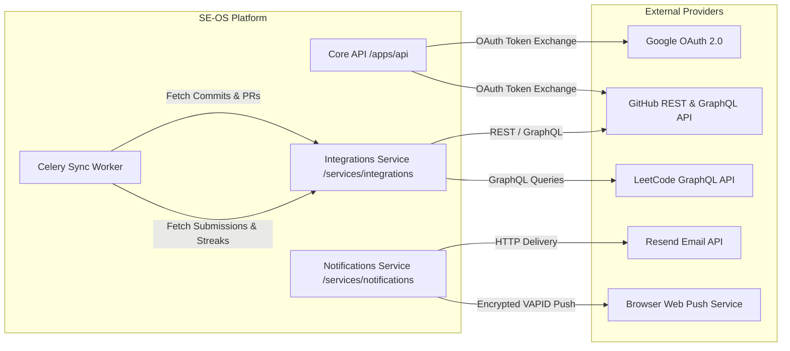

# Integration Architecture

This document defines how **SE-OS** interfaces with external platforms, authentication providers, and developer data sources.

---

## 🔌 Integration Landscape

---

## 🐙 1. GitHub Integration

### Capabilities
- **OAuth Flow:** Users connect their GitHub account via OAuth 2.0 (`read:user`, `repo` scopes).
- **Profile Synchronization:** Ingests user bio, public repositories, star counts, and followers.
- **Contribution Graph:** Queries GitHub GraphQL API for commit counts, pull requests opened, reviews conducted, and calendar active streaks.
- **Recent Activity:** Tracks push events and commit messages over 30 days to measure development velocity.

### Rate Limit Management
- Authenticated requests receive 5,000 requests/hour per user token.
- Background sync tasks employ an exponential backoff retry mechanism and respect `x-ratelimit-reset` headers.

---

## ⚡ 2. LeetCode Integration

### Capabilities
- **Public Profile Sync:** Connects via username handle without requiring password credentials.
- **GraphQL Stats:** Ingests total solved, Easy/Medium/Hard breakdown, global ranking, and active day streaks.
- **Recent Submissions:** Fetches recent accepted submissions with timestamps, question titles, and languages.

### Polling Cadence
- Sync tasks execute via Celery Beat every 6 hours or upon manual user refresh (rate-limited to 1 manual refresh per 15 minutes).

---

## 📧 3. Resend & Web Push Delivery

- **Email Delivery:** Resend HTTP API (`https://api.resend.com/emails`) utilizing responsive branded HTML templates.
- **Push Delivery:** Standard VAPID Web Push protocol (`pywebpush`) with browser service worker subscription endpoints.
