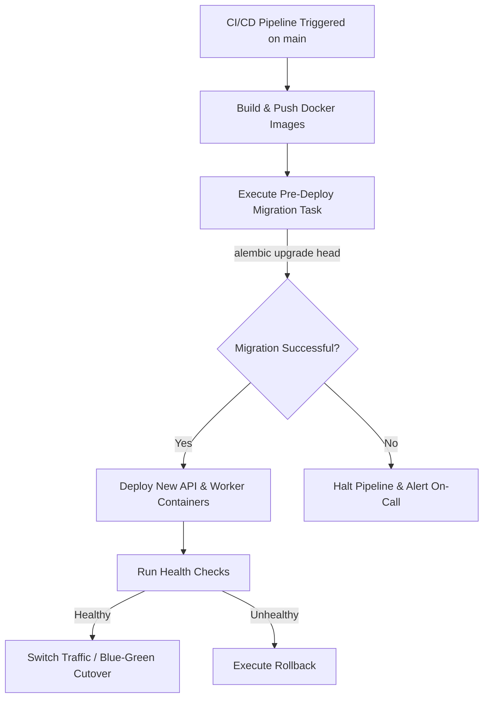

# Production Deployment Guide

This document describes the deployment architecture, configuration, deployment pipeline, and rollback procedures for **SE-OS**.

---

## 🌍 Environments

SE-OS operates across three isolated environments:

| Environment | Purpose | Infrastructure | Branch |
|---|---|---|---|
| **Development** | Feature testing, active developer integration | Local Docker Compose | `develop` |
| **Staging** | Pre-production testing, QA verification, performance benchmarking | AWS ECS / Staging VPC | `build` |
| **Production** | Live end-user traffic | AWS ECS / Multi-AZ VPC / RDS | `main` |

---

## 🐳 Docker Multi-Stage Container Deployment

All services are packaged as hardened, minimal OCI-compliant container images using multi-stage Docker builds.

### Production Images

- **Backend API (`apps/api`):** Gunicorn + Uvicorn workers (`infra/docker/api.Dockerfile` target `production`)
- **Frontend (`apps/web`):** Next.js standalone output with Node.js 20 Alpine (`infra/docker/web.Dockerfile` target `production`)
- **AI Platform (`services/ai`):** High-concurrency Uvicorn service with LangGraph agents (`infra/docker/ai.Dockerfile` target `production`)
- **Notifications Worker (`services/notifications`):** Non-root background daemon consumer (`infra/docker/notifications.Dockerfile` target `production`)

Images run as an unprivileged non-root user (`appuser` with UID 1000) for security isolation.

---

## 🔐 Required Production Environment Variables

Before initiating deployment, verify all required production secrets are configured in AWS Secrets Manager or HashiCorp Vault.

> [!WARNING]
> Never deploy to production with placeholder or development secrets.

| Environment Variable | Severity | Description |
|---|---|---|
| **`SECRET_KEY`** | **CRITICAL** | High-entropy 64-byte secret key used for signing JWT access and refresh tokens. |
| **`DATABASE_URL`** | **CRITICAL** | Production PostgreSQL connection URL (e.g., `postgresql+asyncpg://...` with TLS enabled). |
| **`REDIS_URL`** | **CRITICAL** | Production Redis cluster URI with TLS and authentication password. |
| **`RABBITMQ_URL`** | **CRITICAL** | Production RabbitMQ AMQPS cluster URL with dedicated credentials. |
| **`OPENAI_API_KEY`** | **CRITICAL** | Production API key for OpenAI GPT-4o / embeddings models. |
| **`ANTHROPIC_API_KEY`** | HIGH | API key for Claude 3.5 Sonnet fallback agent execution. |
| **`RESEND_API_KEY`** | HIGH | Verified domain key for transactional email delivery. |
| **`NEXTAUTH_SECRET`** | HIGH | Random secret string for Next.js session encryption. |
| **`SENTRY_DSN`** | HIGH | Error tracking and APM performance monitoring endpoint. |
| **`AWS_ACCESS_KEY_ID`** | HIGH | IAM credentials for Amazon S3 bucket storage. |
| **`AWS_SECRET_ACCESS_KEY`**| HIGH | IAM secret for S3 media asset storage. |

---

## 🚀 Pre-Deployment & Migration Procedure

Database migrations **must always run and complete before new application containers begin serving traffic**.



### Pre-Deploy Migration Task

In ECS or Kubernetes, run an ephemeral task executing:

```bash
python -m alembic upgrade head
```

If the migration step fails, the deployment pipeline halts immediately, leaving existing production containers intact.

---

## 🩺 Health Check Endpoints

All services expose a dedicated, lightweight `/health` probe that validates internal connectivity:

| Service | Protocol | Endpoint URL | Expected Status | Checks Performed |
|---|---|---|---|---|
| **API** | HTTP GET | `http://api:8000/health` | `200 OK` | Database connection, Redis ping, RabbitMQ heartbeat |
| **AI Platform** | HTTP GET | `http://ai:8001/health` | `200 OK` | LLM router configuration, memory store check |
| **Frontend Web** | HTTP GET | `http://web:3000/api/health`| `200 OK` | Node process responsiveness |
| **RabbitMQ** | HTTP GET | `http://rabbitmq:15672/api/health/checks/alarms` | `200 OK` | Disk, memory, and file descriptor limits |

---

## 🔄 Rollback Procedure

In the event of deployment failure or critical post-release regression:

### 1. Traffic Diversion / Container Rollback
- Revert the load balancer target group to the previous stable Task Definition / image tag.
- ECS or Kubernetes automatically terminates unhealthy tasks and routes 100% of traffic to the prior stable release.

### 2. Database Schema Rollback (If Applicable)
If the deployment included an incompatible schema revision:

1. Identify the prior revision identifier:
   ```bash
   alembic history
   ```
2. Revert the migration by one step:
   ```bash
   alembic downgrade -1
   ```
   *(Or downgrade to specific revision: `alembic downgrade <revision_id>`)*

> [!CAUTION]
> Always adhere to backward-compatible database migrations (expand-and-contract pattern) so older containers can function normally alongside new schema columns during rolling rollouts.

### 3. Clear Cache
Flush any stale serialized domain objects from Redis:

```bash
redis-cli -u $REDIS_URL FLUSHDB
```

### 4. Post-Incident Review
Create an incident retrospective documenting root cause, remediation steps, and preventive measures.
