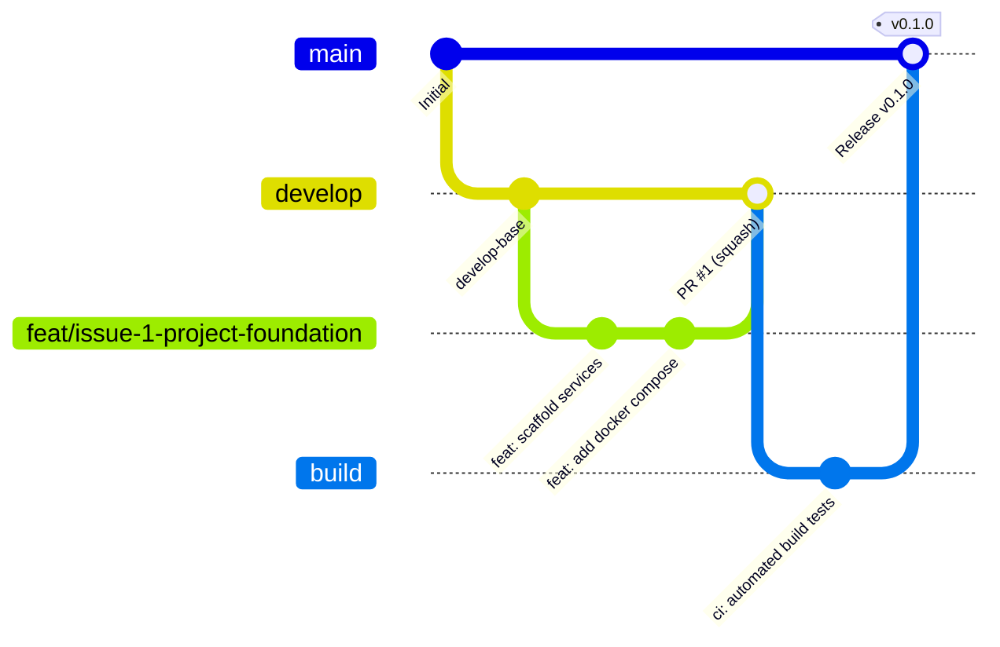

# Git Workflow & Branching Strategy

This document defines the official Git branching model, commit conventions, pull request process, and code review criteria for all contributors to **SE-OS**.

---

## 🌳 Branch Hierarchy

The SE-OS repository uses a structured Git Flow variant designed for continuous integration and stability across multi-service deployments.



### Branch Responsibilities

| Branch | Protection Level | Purpose | Deployment Target |
|---|---|---|---|
| `main` | **Locked** (Review + CI) | Production-ready code. Each commit represents an immutable release tag. | Production Environment |
| `build` | **Protected** (CI only) | Staging integration branch where release builds and end-to-end regression suites execute. | Staging / Pre-prod |
| `develop` | **Protected** (Review + CI) | Primary integration branch. All completed features and non-hotfix bug fixes land here. | Development Environment |
| `feat/issue-N-*` | Unprotected | Feature development branches branched off `develop`. | Local / Ephemeral Preview |
| `fix/issue-N-*` | Unprotected | Bug fixes for issues identified in `develop`. | Local / Ephemeral Preview |
| `hotfix/issue-N-*` | Unprotected | Emergency production patches branched directly from `main`. | Local / Staging |
| `chore/issue-N-*` | Unprotected | Maintenance, tool upgrades, dependency bumps, or refactors. | Local |

---

## 🧭 Step-by-Step Contribution Workflow

Follow these disciplined steps for every unit of work:

### 1. Select or Create an Issue
- Pick an assigned issue from GitHub Projects / Issues (e.g., `#42: Implement LeetCode Sync Worker`).
- Verify requirements and acceptance criteria before writing code.

### 2. Update Local `develop`
Ensure your local branch is synchronized with upstream:

```bash
git checkout develop
git pull origin develop
```

### 3. Create a Feature Branch
Create a new branch from `develop` conforming to the naming rules:

```bash
git checkout -b feat/issue-42-leetcode-sync
```

### 4. Implement and Validate Locally
- Write clean, modular code conforming to [Coding Standards](coding-standards.md).
- Ensure all tests pass in Docker:
  ```bash
  docker compose exec api pytest
  docker compose exec web npm run lint
  ```

### 5. Commit Using Conventional Commits
Stage changes and craft well-structured commit messages:

```bash
git add services/integrations/app/leetcode.py
git commit -m "feat(integrations): add leetcode graphql client for user stats sync"
```

### 6. Push and Open a Pull Request (PR)
Push your branch to GitHub:

```bash
git push -u origin feat/issue-42-leetcode-sync
```

Open a PR against the `develop` branch on GitHub.

### 7. Code Review & CI Verification
- Wait for automated CI checks (linters, unit tests, Docker builds) to pass.
- Address reviewer feedback promptly.
- Once approved by at least 1 core maintainer, squash and merge.

---

## 🏷️ Branch Naming Conventions

All branches must adhere strictly to the pattern: `<type>/issue-<number>-<short-description>`

### Format Rules
- All lowercase, alphanumeric characters and hyphens only (`[a-z0-9-]`).
- Must reference the tracked GitHub issue number.
- Short description should be 2 to 4 kebab-cased words.

| Branch Type | Syntax Example | When to Use |
|---|---|---|
| Feature | `feat/issue-12-auth-session` | Adding new user-facing functionality or capabilities |
| Bug Fix | `fix/issue-19-token-expiration` | Resolving an error or bug on `develop` |
| Chore / Maintenance | `chore/issue-25-bump-pydantic` | Dependency updates, tooling changes, internal config |
| Documentation | `docs/issue-33-api-guide` | Updating or writing documentation only |
| Refactor | `refactor/issue-50-query-optimization` | Code restructures without changing external behavior |
| Hotfix | `hotfix/issue-99-jwt-signing-key` | Urgent production fixes branched off `main` |

---

## 📝 Conventional Commits Guide

Commit messages must follow the [Conventional Commits v1.0.0](https://www.conventionalcommits.org/) standard.

### Message Structure

```text
<type>(<optional scope>): <description>

[optional body]

[optional footer(s)]
```

### Allowed Types

- `feat`: A new feature or capability.
- `fix`: A bug fix.
- `docs`: Documentation changes only.
- `style`: Formatting, missing semicolons, white-space changes (no logic changes).
- `refactor`: Code change that neither fixes a bug nor adds a feature.
- `perf`: A code change that improves performance.
- `test`: Adding missing tests or correcting existing tests.
- `build`: Changes affecting the build system, Dockerfiles, or external dependencies.
- `ci`: Changes to CI/CD configuration files and scripts (GitHub Actions).
- `chore`: Routine maintenance, updating configurations, or internal developer tools.

### Commit Examples

```bash
# Good Feature Commit
feat(notifications): add resend email delivery integration

# Good Fix with Issue Reference
fix(auth): correct token expiration timestamp calculation in jwt handler
Closes #18

# Good Breaking Change Commit
feat(api)!: migrate /v1/user endpoint response to nested schema
BREAKING CHANGE: The 'user_profile' field has been renamed to 'profile'.
```

---

## 🔍 Pull Request (PR) Process

1. **Target Branch:** All feature and chore PRs must target `develop`. Only release PRs target `build` or `main`.
2. **PR Title:** Follow Conventional Commits format (e.g., `feat(roadmap): add dynamic milestone completion tracking`).
3. **PR Description:** Include:
   - Summary of changes
   - Link to issue (`Fixes #<issue_number>` or `Closes #<issue_number>`)
   - Manual verification steps performed
   - Screenshots/GIFs for UI changes
4. **Draft PRs:** Open PRs as a "Draft" if work is still in progress to trigger early CI feedback without requesting review.

---

## 🛡️ Code Review Guidelines

### Reviewer Checklist
Reviewers should evaluate pull requests against the following criteria:

- [ ] **Architecture & Modularity:** Does the code adhere to Domain-Driven Design boundaries? No cross-domain database coupling?
- [ ] **Type Safety:** Are Python type hints and TypeScript interfaces strictly defined (no untyped `Any` / `any`)?
- [ ] **Error Handling:** Are exceptions handled gracefully with structured logs rather than silent passes?
- [ ] **Performance:** Are database queries async and avoiding N+1 loops?
- [ ] **Security:** No secrets or hardcoded credentials committed? Inputs validated with Pydantic/Zod?
- [ ] **Tests:** Are unit or integration tests included covering both happy paths and edge cases?

---

## 🔀 Merge Strategy: Squash vs. Merge Commit

We enforce a deliberate merging strategy depending on the source and destination branches:

| Source Branch | Destination Branch | Merge Method | Rationale |
|---|---|---|---|
| `feat/*`, `fix/*`, `chore/*` | `develop` | **Squash and Merge** | Collapses experimental development commits into a single atomic, meaningful commit with a clean history. |
| `develop` | `build` | **Merge Commit** (`--no-ff`) | Preserves the full chronological history of integrated features for stage verification. |
| `build` | `main` | **Merge Commit** (`--no-ff`) | Produces a clear release merge commit that can be tagged with the semantic release version (e.g. `v1.0.0`). |
| `hotfix/*` | `main` & `develop` | **Merge Commit** | Ensures the emergency fix history remains transparent and is back-ported to `develop`. |
