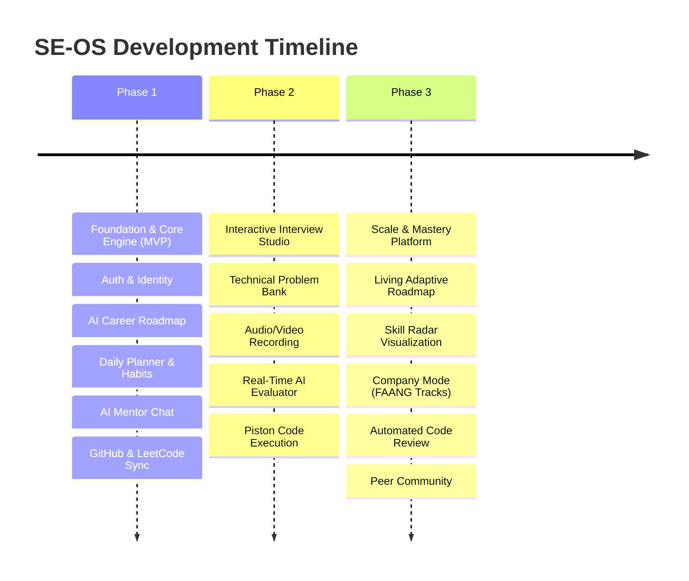

# Product Roadmap

This document outlines the product roadmap for **SE-OS** across three progressive phases: from our core foundational MVP to an enterprise-grade AI Career Operating System.

---

## 🗺️ Roadmap Overview

---

## 🚀 Phase 1: MVP (Foundation & Core Learning Engine)

**Objective:** Deliver an end-to-end personalized learning platform that diagnoses a software engineer's current skills, generates an actionable career roadmap, and keeps them accountable daily.

### Core Capabilities & Features

#### 1. Identity & Onboarding
- Email/password authentication, Google OAuth, and secure JWT session management.
- Comprehensive 5-minute onboarding flow: target role (Backend, Frontend, Full Stack, DevOps, AI Engineer), target companies, current seniority level, hours per week available.
- Resume upload and initial skill extraction using LLM embeddings.

#### 2. AI Career Roadmap Generator
- Dynamic generation of multi-month learning paths split into milestones and actionable nodes.
- Personalized resource recommendations (curated articles, documentation, books, and courses).
- Interactive roadmap visualization with milestone completion tracking.

#### 3. Daily Action Planner & Habit Engine
- Automated generation of 1–3 daily focused tasks (e.g., "Solve 2 Graph BFS problems", "Read Redis replication docs").
- Daily check-in tracking with active streak calculation.
- Automated email and push reminders (`daily_plan_ready`, `streak_at_risk`).

#### 4. AI Engineering Mentor
- Context-aware conversational AI mentor with persistent memory of user's roadmap, struggles, and progress.
- Technical concept explanations, code debugging assistance, and career advice.

#### 5. Unified Engineering Dashboard
- Centralized command center aggregating roadmap progress, current streak, daily plan, and recent achievements.

#### 6. External Developer Integrations
- **GitHub Integration:** OAuth linking, public profile sync, contribution calendar tracking, and recent commit activity.
- **LeetCode Integration:** Username sync, problem solving stats (Easy/Medium/Hard breakdown), and submission activity.

---

## 🎙️ Phase 2: AI Interview Studio

**Objective:** Transform SE-OS into a comprehensive interview simulation suite capable of preparing engineers for rigorous technical, system design, and behavioral interviews.

### Core Capabilities & Features

#### 1. Technical Problem Bank & Sandbox
- Curated library of 300+ categorized software engineering interview questions (Data Structures, Algorithms, Concurrency, SQL, API Design).
- In-browser code editor (Monaco Editor) supporting Python, TypeScript, Go, Java, and C++.
- Isolated sandbox code execution using self-hosted Piston engine.

#### 2. Multi-Modal Audio & Video Recording
- WebRTC-based browser recording of mock interview sessions (audio, webcam, and screen).
- Secure upload of audio/video streams to object storage (MinIO / S3).
- Fast automatic audio transcription powered by OpenAI Whisper.

#### 3. Real-Time AI Interview Assessment
- Automated multi-dimensional scoring rubric evaluating:
  - **Algorithmic Correctness & Complexity:** Time/space complexity analysis.
  - **Communication & Clarity:** Thought-process articulation and structure.
  - **System Design Principles:** Scalability, bottlenecks, trade-offs, and component choices.
  - **Behavioral Fit:** STAR method adherence and leadership principles.
- Actionable post-interview critique report with timestamps and targeted improvement drills.

#### 4. System Design Whiteboard
- Integrated virtual canvas for architectural diagrams, sequence diagrams, and capacity estimation calculations.

---

## 📈 Phase 3: Scale, Intelligence & Community

**Objective:** Expand SE-OS into an ecosystem that continuously adapts to real-world market demands, provides predictive hiring readiness, and fosters engineer collaboration.

### Core Capabilities & Features

#### 1. Living Roadmap Engine
- Autonomous roadmap re-planning: roadmap automatically adjusts when a user solves problems faster or struggles with specific topics.
- Dynamic market synchronization: updates roadmaps based on trending tech stacks and real job market data.

#### 2. Skill Radar & Competency Matrix
- Visual multi-axis radar chart displaying verified competencies across: Algorithms, Architecture, Database Design, DevOps/Cloud, Code Quality, and Soft Skills.

#### 3. Company Mode (Targeted Tracks)
- Specialized interview tracks calibrated to specific hiring bars:
  - FAANG / Big Tech track (Scalability, deep DSA, bar raiser scenarios).
  - High-Growth Startup track (Speed, pragmatic full-stack design, product intuition).
  - Quant / Financial Systems track (Low-latency C++/Rust, memory layout, concurrency).

#### 4. Automated AI Code Review
- Deep pull request and project code reviews evaluating security vulnerabilities, design patterns, clean architecture, and test coverage.

#### 5. Interview Ready Score™
- Proprietary algorithmic index (0–100) quantifying a candidate's probability of clearing target interviews based on practice performance, mock interview history, and problem breadth.

#### 6. Peer Community & Mock Matches
- Anonymous peer-to-peer mock interviews with structured mutual feedback.
- Collaborative study groups and cohort leaderboards.
